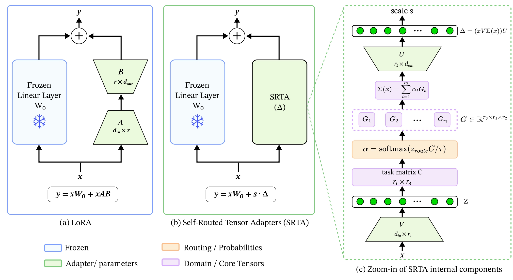

# Self-Routed Tensor Adapters for Parameter-Efficient Universal Visual Adaptation

**Accepted at ECCV Workshop — Archival Track**

**Paper:** [link](https://arxiv.org/pdf/2608.16384v1)

**Dataset:** [link](https://drive.google.com/drive/folders/1msLwydNz7tOc0ODQKVG-PmA6KkKz8XPz?usp=sharing)
## Abstract

Universal visual representations require adaptation mechanisms that work across heterogeneous domains without fragmenting knowledge into domain-specific modules. SRTA introduces a compact parameter-efficient framework that projects each input into a low-rank space, derives routing weights directly from this representation using a learnable domain-coordinate matrix, and uses those weights to blend slices of a shared Tucker core. This produces a sample-specific adaptation matrix without an external gating network, enabling shared visual factors to be reused while retaining domain-aware specialization. A progressive depth-weighted routing objective further supervises routing decisions across adapter layers. Across five multi-domain visual classification benchmarks, SRTA achieves competitive or slightly stronger average accuracy than MoE-style PEFT baselines while using substantially fewer trainable parameters.

## Architecture



## Method

SRTA is a parameter-efficient multi-domain visual adaptation method that performs intrinsic self-routing in the low-rank adapter space and dynamically blends slices of a shared Tucker core tensor.

Adapters are applied to the **Query** and **Value** projections of every ViT transformer layer while the pretrained backbone remains frozen.


## Installation

Create and activate a Python environment:

```bash
conda create -n srta python=3.11 -y
conda activate srta
```

Install the required packages:

```bash
pip install torch torchvision
pip install transformers pillow
```

## Datasets

The code supports:

- PACS
- VLCS
- Office-Home
- Digits-DG
- NICO++

Place datasets inside the `data/` folder:

```text
data/
├── PACS/
├── VLCS/
├── OfficeHome/
├── DigitsDG/
└── NICO++/
```

Lowercase folder aliases such as `pacs`, `vlcs`, `officehome`, `digits`, and `nico` are also accepted by `train.py`.

Each dataset should contain:

```text
<dataset>/
├── train/
├── val/
└── test/
```

with images organized as:

```text
<split>/<domain>/<class>/<image>
```

## Run

Run the code from the repository root.

### PACS

```bash
python train.py PACS
```

### VLCS

```bash
python train.py VLCS
```

### Office-Home

```bash
python train.py OfficeHome
```

### Digits-DG

```bash
python train.py DigitsDG
```

### NICO++

```bash
python train.py NICO++
```

If your system uses `python3`, replace `python` with `python3`.

## Results

Main paper results at rank 64:

| Method | PACS | VLCS | Office-Home | Digits-DG | NICO++ | Average |
|---|---:|---:|---:|---:|---:|---:|
| **SRTA** | **95.2 ± 0.7** | **84.7 ± 0.3** | **84.8 ± 0.7** | **92.7 ± 0.6** | **83.0 ± 0.4** | **88.1** |

## Citation

```bibtex
@misc{yadav2026selfroutedtensoradaptersparameterefficient,
      title={Self-Routed Tensor Adapters for Parameter-Efficient Universal Visual Adaptation}, 
      author={Suraj Yadav},
      year={2026},
      eprint={2608.16384},
      archivePrefix={arXiv},
      primaryClass={cs.CV},
      url={https://arxiv.org/abs/2608.16384}, 
}
```
